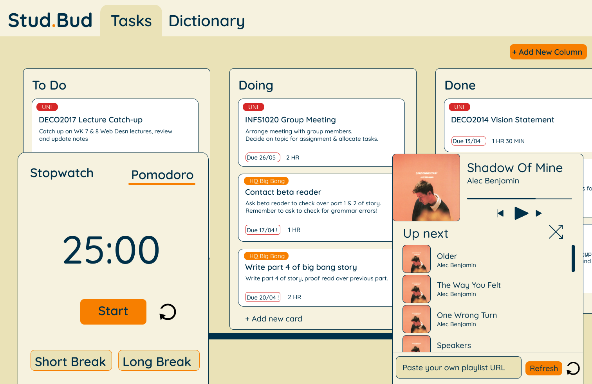
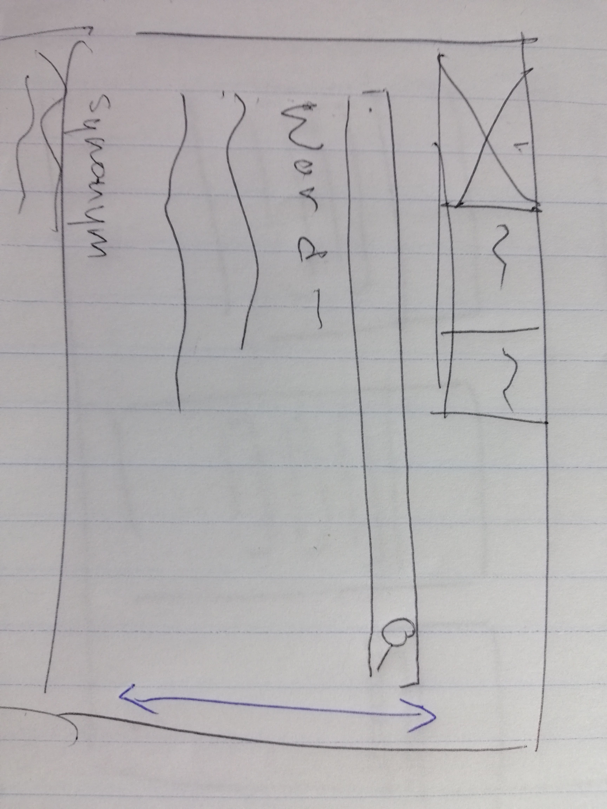
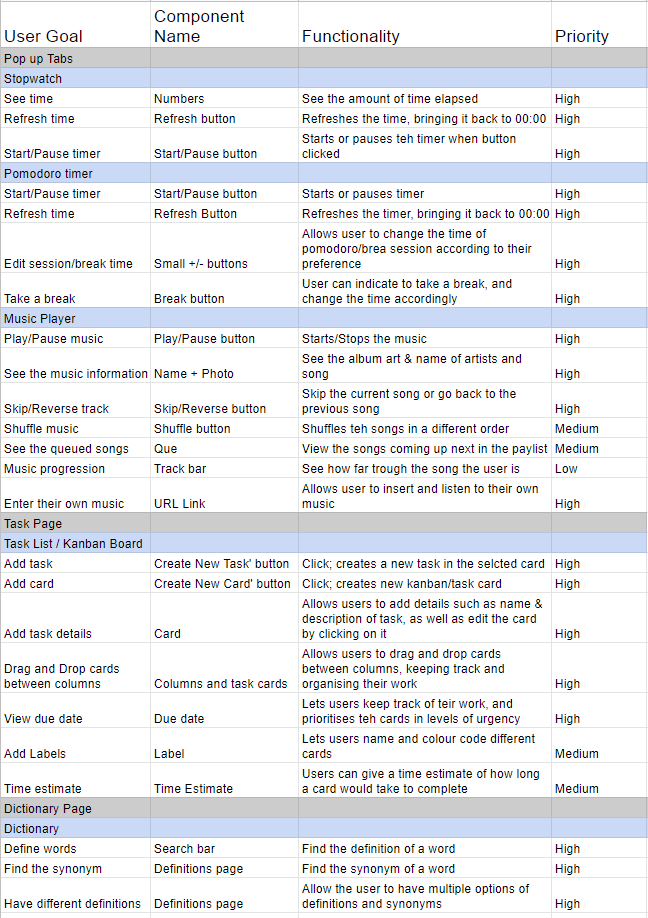

# StudBud

The most major changes done to this prototype, comapared to the web pitch is teh layout of teh site. 

Taking into consideration both my coding skills and the limited time, I made the decision to change the layout of Studbud to place each elemnet in its own separate page, similar to one of the earlier iterations of the site that I discussed in the pitch.

Using the functional specification list, I tried to include most of the *High Priority* functions that should be included in teh application. However unfortunately, due to both my lack of skill and time to work on this project, I had to make the decision to omit some functions of the app. Ultimately, I had to decide which tasks were of *most* importance to both my target audience, as well as the design brief.

For the __kanban board__, I kept the option for users to drag and drop tasks within the columns, as well as add and delete new tasks. Users can also drag tasks between each other in columns, to rank the level of priority themselves. I found that these were some of the most crucial elements in the task, which I wanted to include. However, as a result, I wasnt able to include secondary actions such as the due date, estimated time and colour coding of tasks that I had wanted to during my pitch. 

The __stopwatch__ allows users to view time elapsed, start, stop/pause and reset the timer by pressing on the corresponding buttons. 

The __pomodoro timer__ works by having the user press on the time to start the timer. They can then reset it, and adjust their own break and focus times. A bell will also ring when the timeinputed has finished.

For teh __dictionary__, i used the merriam-webster api. 

And for the __music player__ i used an embeded music player. ALthough it doesn't seem to properly work in my browser. 

I am aware that there are many faults and needs for improvements in my code, __*ESPECIALLY*__ in terms of the nav bar, music player, and the responsiveness of the site but i have to admit that with my current coding abilities, it is not possible to to work out and debug the errors before the due date. Please understand that I have tried my best, and I am aware that there can be many improvements made in the future in regards to my StudBud. 

## References: 
* Pomodoro Timer: https://github.com/abhik-b/pomodro-timer/blob/master/timer.js 
* Music Player: https://www.youtube.com/watch?v=Zf_psaJ-wP4&ab_channel=ModernWeb 
* Pomodoro Timer: https://www.youtube.com/watch?v=MtYR2vCs2R0&ab_channel=abhikb 
* Dictionary: https://github.com/WaisAyam/Dictionary-with-JavaScript 
* https://unsplash.com/photos/28ZbKOWiZfs [image]
* Music: https://www.youtube.com/watch?v=ZW6SmigKS7k 
* Kanban Board: https://www.youtube.com/watch?v=m3StLl-H4CY&t=1407s 
* Stopwatch: https://www.youtube.com/watch?v=49f1cjZWRJA 
